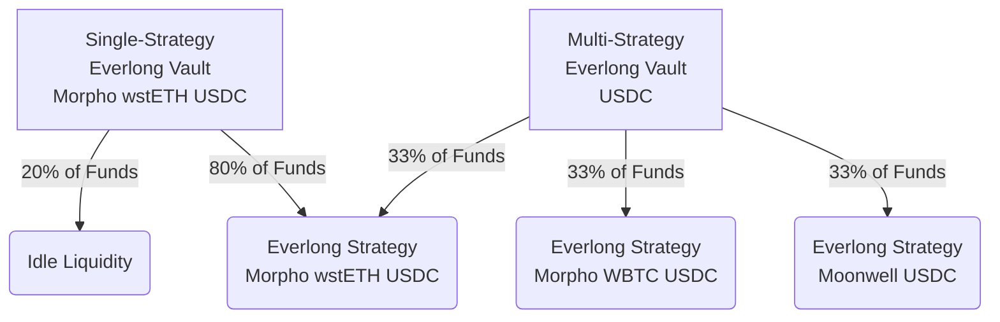

# Everlong

🎸

A money market powered by [Hyperdrive](https://github.com/delvtech/hyperdrive)
and [Yearn](https://docs.yearn.fi/).

<!--toc:start-->

- [Requirements](#requirements)
- [Getting Started](#getting-started)
- [Actions](#actions)
  - [Fork mainnet locally](#fork-mainnet-locally)
  - [Deploy a `RoleManager`](#deploy-a-rolemanager)
  - [Deploy an `EverlongStrategyKeeper`](#deploy-an-everlongstrategykeeper)
  - [Deploy an `EverlongStrategy`](#deploy-an-everlongstrategy)
- [Components](#components)
  - [Common](#common)
    - [RoleManager](#rolemanager)
    - [DebtAllocator](#debtallocator)
    - [Accountant](#accountant)
  - [Everlong](#everlong)
    - [EverlongStrategy](#everlongstrategy)
    - [EverlongVault](#everlongvault)
- [Roles](#roles)
  - [Deployer](#deployer)
  - [Governance](#governance)
  - [Management](#management)
  - [Keeper](#keeper)
- [Diagrams](#diagrams)
  - [Asset Flow](#asset-flow)
  - [Vault Debt Allocation](#vault-debt-allocation)

<!--toc:end-->

## Actions

Deploy and interact with contracts.

Deployed contract artifacts will be saved to `./deploy/${CHAIN_ID}/`.

Deploy commands will currently fail if the appropriate directories have not been
created. The following command can be run to create the directories:

```sh
mkdir -p deploy/${CHAIN_ID}/roleManagers \
  && mkdir -p deploy/${CHAIN_ID}/keeperContracts \
  && mkdir -p deploy/${CHAIN_ID}/strategies \
  && mkdir -p deploy/${CHAIN_ID}/vaults
```

### Fork mainnet locally

```sh
# Use a different chain id so deployment output files don't get overridden.
source .env && \
  anvil \
  --rpc-url $MAINNET_RPC_URL \
  --chain-id 1234
```

### Deploy a `RoleManager`

```sh
source .env && \
  forge script script/DeployRoleManager.s.sol --rpc-url 0.0.0.0:8545 --broadcast
```

### Deploy an `EverlongStrategyKeeper`

```sh
source .env && \
  forge script script/DeployEverlongStrategyKeeper.s.sol --rpc-url 0.0.0.0:8545 --broadcast
```

### Deploy an `EverlongStrategy`

```sh
source .env && \
  NAME='<your_strategy_name>' \
  HYPERDRIVE='<your_hyperdrive_address>' \
  forge script script/DeployEverlongStrategy.s.sol --rpc-url 0.0.0.0:8545 --broadcast
```

### Deploy a `Vault`

```sh
source .env && \
  STRATEGY_NAME='<name_of_a_deployed_strategy>' \
  NAME='<your_vault>' \
  SYMBOL='<your_vault_symbol>' \
  CATEGORY=<your_category_number> \
  forge script script/DeployVault.s.sol --rpc-url 0.0.0.0:8545 --broadcast
```

## Components

Vaults are built upon
[Yearn's TokenizedStrategy Framework](https://docs.yearn.fi/developers/v3/strategy_writing_guide)
which involves numerous mandatory and optional components.

### Common

The contracts below are common to all vaults.

#### RoleManager

- Handles assignment and validation of the various privileged roles in the system.
- Offers additional functionality via periphery contracts like `DebtAllocator`
  and `Accountant`.
- Maintains a list of all vaults under control of the `RoleManager`.

#### DebtAllocator

- Provides the needed triggers that enable a keeper to perform automated debt updates
  for the vault and its strategies.
- Enables specifying how much liquidity to deposit from a vault into each of its
  strategies.

#### Accountant

- Can charge fees, issue refunds, and run a health check on any reported gains or
  losses during a strategy's report.

### Everlong

The contracts below are specific to Everlong vaults.

#### EverlongStrategy

- A `TokenizedStrategy` that converts deposited assets into long positions in
  Hyperdrive.
- When longs become mature, they are sold and new longs are purchased with the
  proceeds.
- Immature longs will be sold to fulfill withdrawals/redemptions.

#### EverlongVault

- A Yearn v3 Vault that deposits into an `EverlongStrategy`.
- Can maintain a set level of idle liquidity to service withdrawals/redemptions
  without forcing the strategy to sell immature longs.
- _Future Plans_: Deposit into multiple `EverlongStrategy`s to receive weighted
  average yields from each.

## Roles

Multiple privileged roles are needed for the deployment, configuration, and
maintenance of Everlong vaults and strategies. The roles and their uses are described
below.

### Deployer

Deployer of the contracts. Does not have any elevated privileges.

### Governance

Capable of making critical changes to a vault.

For our situation, we use the governance role to:

- Add strategies to the vault.
- Change the `max_debt` for a vault strategy.
- Toggling `auto_allocate` for the vault.
- Update the vault's fee and `maxLoss` configuration via the `Accountant`.

### Management

Capable of making minor operational changes to the vault and periphery contracts.

For our situation, we use the management role to:

- Set the vault's `profitMaxUnlockTime`.
- Set the `DebtAllocator`'s `minimumWait`.
- Set the `DebtAllocator`'s `minimumChange`.
- Set the `DebtAllocator`'s `strategyDebtRatio` for a vault's strategy.

### Keeper

Capable of performing maintenance on a vault and its strategies.

For our situation, we use the keeper role to:

- Poll `tendTrigger()` on strategies to check whether they need to be tended.
- Call `tend()` when a strategy needs to be tended.
- Call `report()` on a strategy to realize gains/losses and update `totalAssets`
  for the strategy.
- Call `process_report()` on the vault, for all strategies used by the vault,
  to realize gains/losses. This should be called on approximately the same frequency
  as the vault's `profitMaxUnlockTime`.

## Diagrams

Vaults are build on top of
[Yearn's TokenizedStrategy Framework](https://docs.yearn.fi/developers/v3/strategy_writing_guide)
and leverages [v3 Vaults](https://docs.yearn.fi/developers/v3/overview) to
control idle liquidity (and eventually combine multiple strategies). Asset flow
and role management across the various components is complex. Below are some diagrams
to assist in clarifying how each component works with one another.

### Asset Flow

The diagram below outlines the interactions between components at various stages
in the vault lifecycle (deposit, tend/report, and redeem).


### Vault Debt Allocation

Yearn vaults can allocate a configurable amount of liquidity to one or more strategies.

Allocating less than 100% of the vault's liquidity to strategies (like the
`Single-Strategy` vault shown below) results in maintained idle liquidity. This
idle liquidity is then used to service withdrawals without having to unwind
assets from the strategy, which reduces gas costs for the withdrawer and position
churn for the strategy.

Multi-Strategy vaults (like the one shown below) can diversify their debt
allocation across multiple strategies and vaults in configurable ratios. New strategies
can be added to existing vaults and the amount of debt allocated to each strategy
can be updated at any time.


