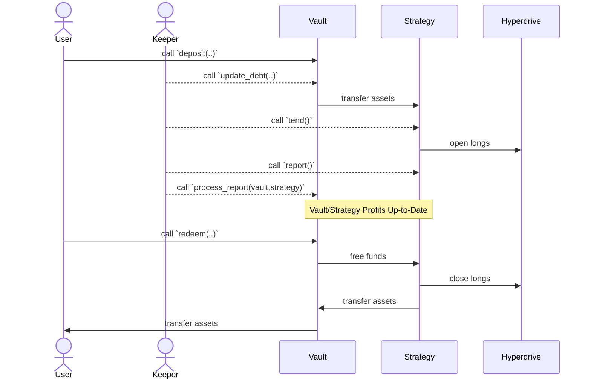

# Everlong

🎸

A money market powered by [Hyperdrive](https://github.com/delvtech/hyperdrive)
and [Yearn](https://docs.yearn.fi/).

## Requirements

- MacOS or Linux
- [Foundry](https://book.getfoundry.sh/)
- [Bun](https://bun.sh/)

## Getting Started

1. Install NPM packages

```sh
bun install
```

1. Compile the contracts

```sh
make build
```

1. Run tests

```sh
make test
```

## System Overview

Everlong is build on top of
[Yearn's TokenizedStrategy Framework](https://docs.yearn.fi/developers/v3/strategy_writing_guide)
and leverages [v3 Vaults](https://docs.yearn.fi/developers/v3/overview) to
control idle liquidity (and eventually combine multiple strategies). Asset flow
and role management across the various components is complex. Below are some diagrams
to assist in clarifying how each component works with one another.

### Components

<details><summary>EverlongStrategy</summary><p>
- A `TokenizedStrategy` that converts deposited assets into long positions in
  Hyperdrive.
- When longs become mature, they are sold and new longs are purchased with the
  proceeds.
- Immature longs will be sold to fulfill withdrawals/redemptions.
</p></details>

#### EverlongStrategy

- A `TokenizedStrategy` that converts deposited assets into long positions in
  Hyperdrive.
- When longs become mature, they are sold and new longs are purchased with the
  proceeds.
- Immature longs will be sold to fulfill withdrawals/redemptions.

#### EverlongVault

- A Yearn v3 Vault that deposits into an `EverlongStrategy`.
- Can maintain a set level of idle liquidity to service withdrawals/redemptions
  without forcing the strategy to sell immature longs.
- _Future Plans_: Deposit into multiple `EverlongStrategy`s to receive weighted
  average yields from each.

#### RoleManager

- Handles assignment and validation of the various privileged roles in the system.
- Offers additional functionality via periphery contracts like `DebtAllocator`
  and `Accountant`.
- Maintains a list of all vaults under control of the `RoleManager`.

#### DebtAllocator

- Provides the needed triggers that enable a keeper to perform automated debt updates
  for the vault and its strategies.
- Enables specifying how much liquidity to deposit from a vault into each of its
  strategies.

#### Accountant

- Can charge fees, issue refunds, and run a health check on any reported gains or
  losses during a strategy's report.

### Roles

#### Deployer

Deployer of the contracts. Does not have any elevated privileges.

#### Governance

Capable of making critical changes to a vault.

For our situation, we use the governance role to:

- Add strategies to the vault.
- Change the `max_debt` for a vault strategy.
- Toggling `auto_allocate` for the vault.
- Update the vault's fee and `maxLoss` configuration via the `Accountant`.

#### Management

Capable of making minor operational changes to the vault and periphery contracts.

For our situation, we use the management role to:

- Set the vault's `profitMaxUnlockTime`.
- Set the `DebtAllocator`'s `minimumWait`.
- Set the `DebtAllocator`'s `minimumChange`.
- Set the `DebtAllocator`'s `strategyDebtRatio` for a vault's strategy.

#### Keeper

Capable of performing maintenance on a vault and its strategies.

For our situation, we use the keeper role to:

- Poll `tendTrigger()` on strategies to check whether they need to be tended.
- Call `tend()` when a strategy needs to be tended.
- Call `report()` on a strategy to realize gains/losses and update `totalAssets`
  for the strategy.
- Call `process_report()` on the vault, for all strategies used by the vault,
  to realize gains/losses. This should be called on approximately the same frequency
  as the vault's `profitMaxUnlockTime`.

### Asset Flow


