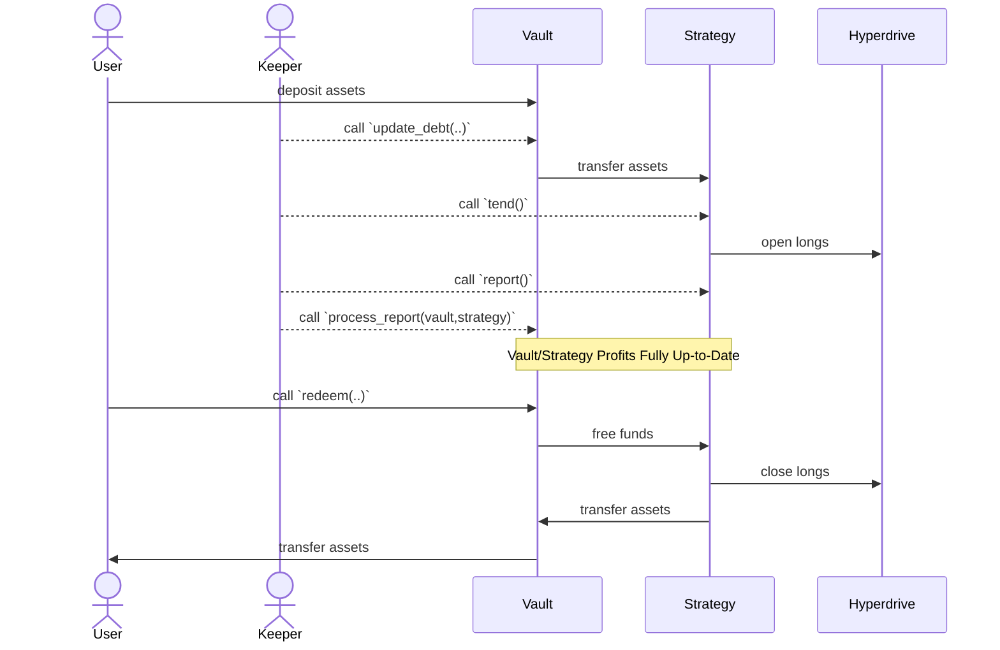

# Everlong

🎸

A money market powered by [Hyperdrive](https://github.com/delvtech/hyperdrive)
and [Yearn](https://docs.yearn.fi/).

## Requirements

- MacOS or Linux
- [Foundry](https://book.getfoundry.sh/)
- [Bun](https://bun.sh/)

## Getting Started

1. Install NPM packages

```sh
bun install
```

1. Compile the contracts

```sh
make build
```

1. Run tests

```sh
make test
```

## System Overview

Everlong is build on top of
[Yearn's TokenizedStrategy Framework](https://docs.yearn.fi/developers/v3/strategy_writing_guide)
and leverages [v3 Vaults](https://docs.yearn.fi/developers/v3/overview) to
control idle liquidity (and eventually combine multiple strategies). Asset flow
and role management across the various components is complex. Below are some diagrams
to assist in clarifying how each component works with one another.

### Asset Flow


